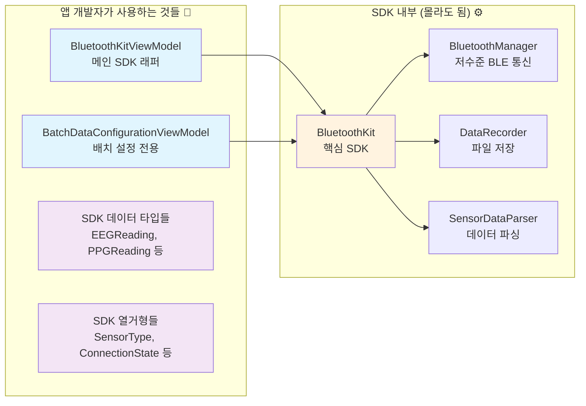

# LinkBand BluetoothKit SDK 🎯

**실시간 생체신호 센서 데이터 수집을 위한 iOS SDK**

LinkBand 센서 디바이스와 연결하여 EEG(뇌전도), PPG(심박수), 가속도계, 배터리 데이터를 실시간으로 수집하고 기록할 수 있는 SwiftUI 친화적 SDK입니다.

## ✨ 핵심 기능

### 📡 **실시간 센서 데이터**
- **EEG (뇌전도)**: 2채널 뇌파 데이터 + 전극 접촉 상태
- **PPG (광전용적맥파)**: Red/IR 심박수 센서 데이터  
- **가속도계**: 3축 움직임 데이터 (원시값/움직임 모드)
- **배터리**: 실시간 배터리 레벨 모니터링

### 🎛️ **스마트한 데이터 수집**
- **배치 수집**: 샘플 수 또는 시간 간격 기반 배치 데이터 수집
- **센서별 설정**: 각 센서마다 독립적인 샘플링 설정
- **실시간 모니터링**: 설정한 배치가 완성되면 즉시 알림

### 📝 **자동 데이터 기록**
- **CSV 파일 저장**: 센서별로 타임스탬프와 함께 저장
- **파일 관리**: 저장된 파일 목록 조회 및 공유
- **선택적 기록**: 원하는 센서만 선택해서 기록

### 🔄 **안정적인 연결 관리**
- **자동 재연결**: 연결이 끊어져도 자동으로 재연결 시도
- **디바이스 스캔**: 주변 LinkBand 디바이스 자동 발견
- **연결 상태 모니터링**: 실시간 연결 상태 추적

## 🏗️ SDK 아키텍처



### 🎯 **앱 개발자 관점에서 필요한 것들**

1. **ViewModels**: SwiftUI와 SDK를 연결하는 어댑터
2. **데이터 타입들**: 센서 데이터를 담는 구조체들  
3. **열거형들**: 센서 종류, 연결 상태 등을 나타내는 타입들
4. **델리게이트 프로토콜**: 배치 데이터 수신이 필요한 경우만

## 🚀 빠른 시작

### 1️⃣ 기본 설정

```swift
import SwiftUI
import BluetoothKit

struct ContentView: View {
    @StateObject private var bluetoothKit = BluetoothKitViewModel()
    
    var body: some View {
        VStack {
            // 연결 상태 표시
            Text(bluetoothKit.connectionStatusDescription)
            
            // 스캔/연결 버튼
            if bluetoothKit.isScanning {
                Button("스캔 중지") { bluetoothKit.stopScanning() }
            } else {
                Button("스캔 시작") { bluetoothKit.startScanning() }
            }
            
            // 발견된 디바이스 목록
            ForEach(bluetoothKit.discoveredDevices, id: \.id) { device in
                Button(device.name) {
                    bluetoothKit.connect(to: device)
                }
            }
        }
    }
}
```

### 2️⃣ 실시간 센서 데이터 표시

```swift
struct SensorDataView: View {
    @ObservedObject var bluetoothKit: BluetoothKitViewModel
    
    var body: some View {
        VStack {
            // EEG 데이터
            if let eeg = bluetoothKit.latestEEGReading {
                VStack {
                    Text("🧠 EEG 데이터")
                    HStack {
                        Text("CH1: \(String(format: "%.1f", eeg.channel1))µV")
                        Text("CH2: \(String(format: "%.1f", eeg.channel2))µV")
                    }
                    Text("전극 접촉: \(eeg.leadOff ? "❌" : "✅")")
                }
                .padding()
                .background(Color.purple.opacity(0.1))
                .cornerRadius(12)
            }
            
            // PPG 데이터
            if let ppg = bluetoothKit.latestPPGReading {
                VStack {
                    Text("❤️ PPG 데이터")
                    HStack {
                        Text("Red: \(ppg.red)")
                        Text("IR: \(ppg.ir)")
                    }
                }
                .padding()
                .background(Color.red.opacity(0.1))
                .cornerRadius(12)
            }
            
            // 가속도계 데이터
            if let accel = bluetoothKit.latestAccelerometerReading {
                VStack {
                    Text("🏃‍♂️ 가속도계")
                    HStack {
                        Text("X: \(accel.x)")
                        Text("Y: \(accel.y)")
                        Text("Z: \(accel.z)")
                    }
                    
                    // 모드 전환
                    Picker("모드", selection: $bluetoothKit.accelerometerMode) {
                        Text("원시값").tag(AccelerometerMode.raw)
                        Text("움직임").tag(AccelerometerMode.motion)
                    }
                    .pickerStyle(SegmentedPickerStyle())
                }
                .padding()
                .background(Color.blue.opacity(0.1))
                .cornerRadius(12)
            }
            
            // 배터리
            if let battery = bluetoothKit.latestBatteryReading {
                VStack {
                    Text("🔋 배터리: \(battery.level)%")
                    ProgressView(value: Double(battery.level), total: 100.0)
                }
                .padding()
                .background(Color.green.opacity(0.1))
                .cornerRadius(12)
            }
        }
    }
}
```

### 3️⃣ 데이터 기록

```swift
struct RecordingControlView: View {
    @ObservedObject var bluetoothKit: BluetoothKitViewModel
    
    var body: some View {
        VStack {
            // 기록 상태 표시
            HStack {
                if bluetoothKit.isRecording {
                    Image(systemName: "record.circle.fill")
                        .foregroundColor(.red)
                    Text("기록 중")
                        .foregroundColor(.red)
                } else {
                    Image(systemName: "record.circle")
                        .foregroundColor(.gray)
                    Text("기록 준비")
                        .foregroundColor(.gray)
                }
            }
            
            // 기록 버튼
            Button(bluetoothKit.isRecording ? "기록 중지" : "기록 시작") {
                if bluetoothKit.isRecording {
                    bluetoothKit.stopRecording()
                } else {
                    bluetoothKit.startRecording()
                }
            }
            .disabled(!bluetoothKit.isConnected)
            .buttonStyle(.borderedProminent)
            .tint(bluetoothKit.isRecording ? .red : .blue)
            
            // 저장된 파일 개수
            Text("저장된 파일: \(bluetoothKit.recordedFiles.count)개")
                .font(.caption)
                .foregroundColor(.secondary)
        }
        .padding()
    }
}
```

### 4️⃣ 배치 데이터 수집 (고급)

```swift
struct BatchDataView: View {
    @ObservedObject var bluetoothKit: BluetoothKitViewModel
    @StateObject private var batchViewModel: BatchDataConfigurationViewModel
    
    init(bluetoothKit: BluetoothKitViewModel) {
        self.bluetoothKit = bluetoothKit
        self._batchViewModel = StateObject(wrappedValue: 
            BatchDataConfigurationViewModel(bluetoothKit: bluetoothKit.sdkInstance)
        )
    }
    
    var body: some View {
        VStack {
            // 수집 모드 선택
            Picker("수집 모드", selection: $batchViewModel.selectedCollectionMode) {
                Text("샘플 수").tag(BatchDataConfigurationManager.CollectionMode.sampleCount)
                Text("초 단위").tag(BatchDataConfigurationManager.CollectionMode.seconds)
                Text("분 단위").tag(BatchDataConfigurationManager.CollectionMode.minutes)
            }
            .pickerStyle(SegmentedPickerStyle())
            
            // 센서별 설정
            ForEach([SensorType.eeg, .ppg, .accelerometer], id: \.self) { sensor in
                HStack {
                    Text("\(sensor.emoji) \(sensor.displayName)")
                    
                    Spacer()
                    
                    // 샘플 수 설정 예시
                    if batchViewModel.selectedCollectionMode == .sampleCount {
                        TextField("샘플 수", text: .init(
                            get: { batchViewModel.getSampleCountText(for: sensor) },
                            set: { batchViewModel.setSampleCountText($0, for: sensor) }
                        ))
                        .textFieldStyle(RoundedBorderTextFieldStyle())
                        .frame(width: 80)
                        .keyboardType(.numberPad)
                    }
                }
            }
            
            // 모니터링 제어
            if batchViewModel.isMonitoringActive {
                Button("모니터링 중지") {
                    batchViewModel.stopMonitoring()
                }
                .buttonStyle(.bordered)
                .tint(.red)
            } else {
                Button("모니터링 시작") {
                    batchViewModel.startMonitoring()
                }
                .buttonStyle(.borderedProminent)
                .disabled(batchViewModel.selectedSensors.isEmpty)
            }
        }
        .padding()
    }
}
```

## 📚 주요 데이터 타입

### 센서 데이터
```swift
// EEG (뇌전도)
struct EEGReading {
    let channel1: Double        // CH1 전압 (µV)
    let channel2: Double        // CH2 전압 (µV)
    let ch1Raw: Int            // CH1 원시값
    let ch2Raw: Int            // CH2 원시값
    let leadOff: Bool          // 전극 접촉 상태
    let timestamp: Date        // 타임스탬프
}

// PPG (심박수)
struct PPGReading {
    let red: Int               // Red LED 값
    let ir: Int                // IR LED 값  
    let timestamp: Date        // 타임스탬프
}

// 가속도계
struct AccelerometerReading {
    let x: Int                 // X축 값
    let y: Int                 // Y축 값
    let z: Int                 // Z축 값
    let timestamp: Date        // 타임스탬프
}

// 배터리
struct BatteryReading {
    let level: Int             // 배터리 레벨 (0-100%)
    let timestamp: Date        // 타임스탬프
}
```

### 열거형
```swift
// 센서 타입
enum SensorType: String, CaseIterable {
    case eeg = "eeg"
    case ppg = "ppg" 
    case accelerometer = "accelerometer"
    case battery = "battery"
}

// 가속도계 모드
enum AccelerometerMode: String, CaseIterable {
    case raw = "raw"           // 원시값 모드
    case motion = "motion"     // 움직임 모드 (중력 제거)
}

// 연결 상태
enum ConnectionState {
    case disconnected          // 연결 안됨
    case scanning             // 스캔 중
    case connecting           // 연결 중
    case connected            // 연결됨
    case reconnecting         // 재연결 중
    case failed               // 연결 실패
}
```

## 📂 데모 앱 구조

```
LinkBandDemo/
├── ContentView.swift                 # 메인 화면
├── ViewModels/                       # SDK 어댑터
│   ├── BluetoothKitViewModel.swift   # 메인 ViewModel
│   └── BatchDataConfigurationViewModel.swift  # 배치 설정
└── Views/
    ├── SensorData/                   # 센서 데이터 표시
    │   ├── EEGDataCard.swift
    │   ├── PPGDataCard.swift
    │   ├── AccelerometerDataCard.swift
    │   └── BatteryDataCard.swift
    ├── Controls/                     # 제어 UI
    │   ├── ControlsView.swift
    │   ├── RecordingControlsView.swift
    │   └── SimplifiedBatchDataCollectionView.swift
    ├── StatusCard/                   # 연결 상태
    │   └── EnhancedStatusCardView.swift
    └── Files/                        # 파일 관리
        ├── RecordedFilesView.swift
        └── FileRowView.swift
```

## 🎯 사용자 플로우

1. **📱 앱 시작** → Bluetooth 상태 확인
2. **🔍 디바이스 스캔** → LinkBand 디바이스 발견 및 목록 표시
3. **🔗 디바이스 연결** → 선택한 디바이스에 연결
4. **📊 실시간 데이터** → EEG, PPG, 가속도계, 배터리 데이터 실시간 표시
5. **⚙️ 설정 조정** → 센서별 배치 수집 설정 (선택사항)
6. **📝 데이터 기록** → 원하는 센서 데이터를 파일로 저장
7. **📂 파일 관리** → 저장된 CSV 파일 조회, 공유, 삭제

## 🛠️ 설치 및 요구사항

### 요구사항
- iOS 13.0+
- Xcode 14.0+
- Swift 5.7+

### 설치
1. 프로젝트에 `BluetoothKit` 폴더 추가
2. `LinkBandDemo` 프로젝트 참조하여 ViewModels 구현
3. `Info.plist`에 Bluetooth 권한 추가:
```xml
<key>NSBluetoothAlwaysUsageDescription</key>
<string>센서 디바이스와 연결하여 생체신호 데이터를 수집합니다.</string>
<key>NSBluetoothPeripheralUsageDescription</key>
<string>센서 디바이스와 연결하여 생체신호 데이터를 수집합니다.</string>
```

## 💡 개발 팁

### ✅ **권장사항**
- ViewModels를 사용해서 SDK와 UI 분리
- `@Published` 프로퍼티로 실시간 UI 업데이트
- 연결 상태를 항상 체크한 후 기능 사용
- 자동 재연결 기능 활용으로 사용자 경험 향상

### ⚠️ **주의사항**
- 기록 중에는 센서 설정 변경 제한
- 앱이 백그라운드로 가면 연결이 끊어질 수 있음
- 배터리 소모를 고려해서 불필요한 센서는 비활성화
- CSV 파일이 누적되므로 주기적인 정리 필요

## 📞 지원

- **데모 앱**: `LinkBandDemo` 프로젝트 참조
- **문서**: 코드 내 주석 및 이 README 참조
- **예제**: 각 View 파일에서 실제 사용 패턴 확인

---

**Happy Coding! 🎉** 